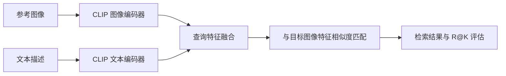
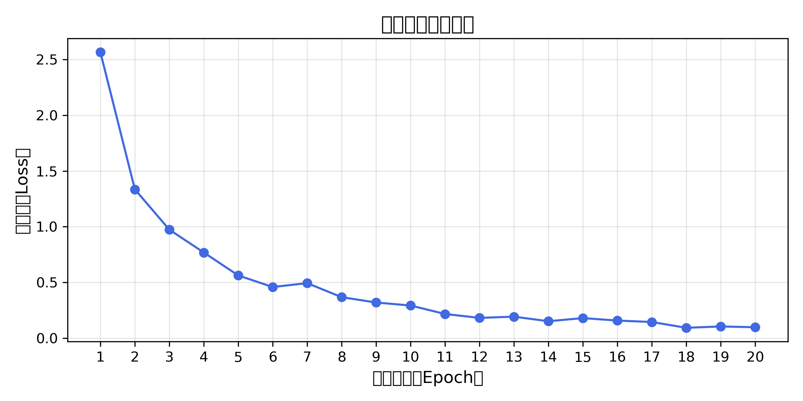
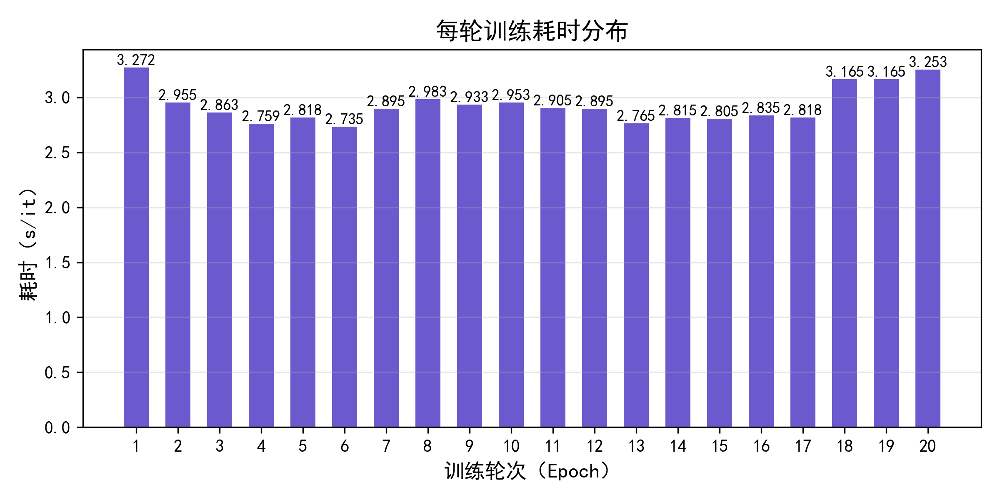
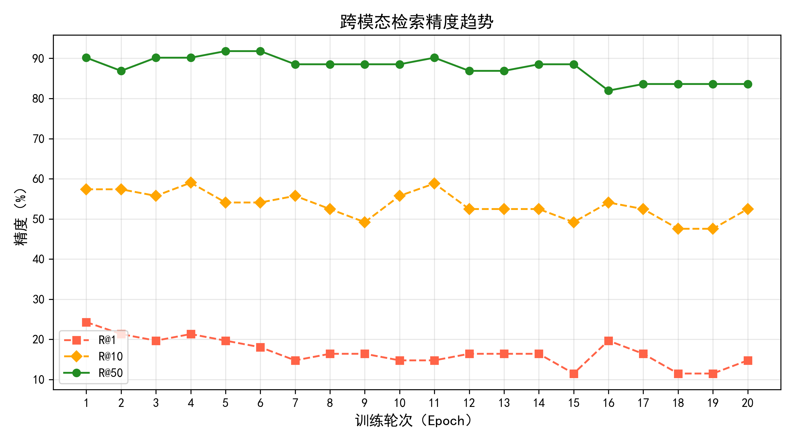
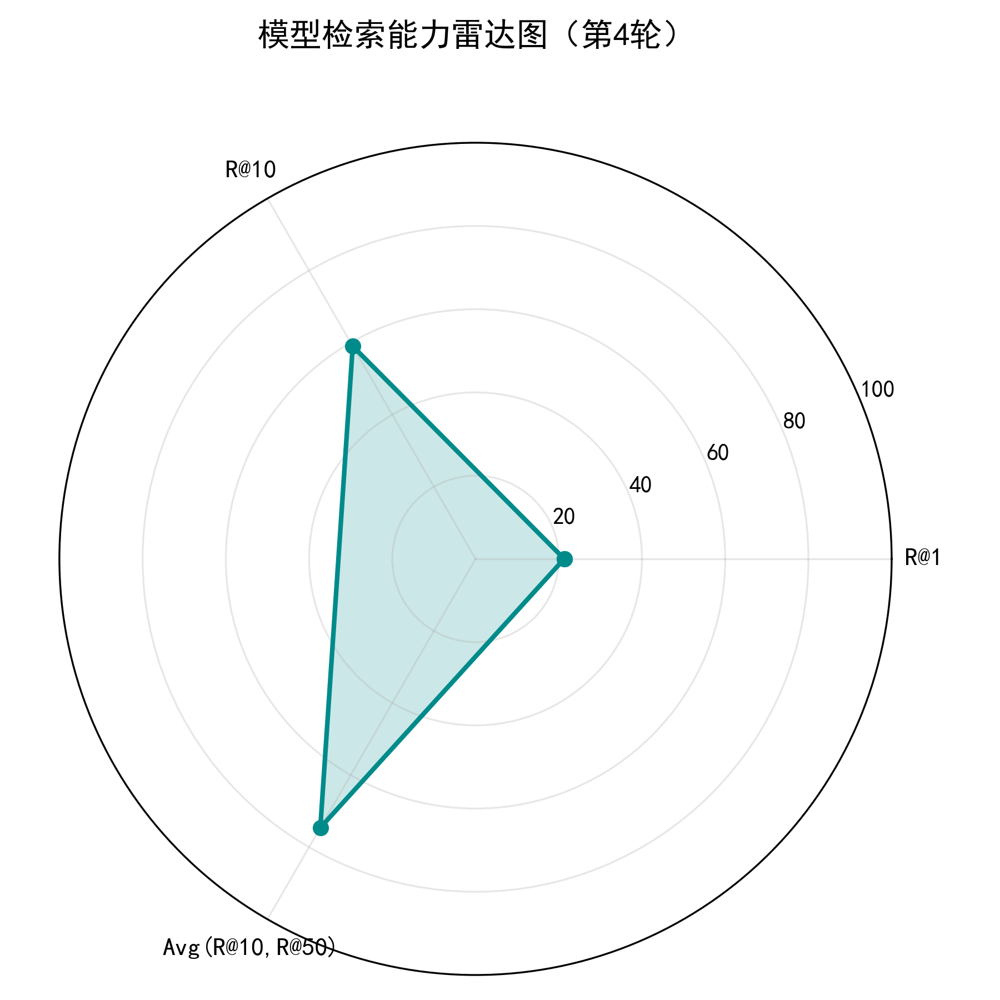

# 多模态学习导论课程项目（CLIP 检索）

<div align="center">


</div>

本仓库为《多模态学习导论》课程作业的工程化实现，聚焦“文本描述 + 参考图像”的跨模态检索任务，基于 CLIP 构建完整训练与评估流程。

> 课程：多模态学习导论  
> 任务：Composed Image Retrieval（文本 + 参考图像融合检索）

## 项目亮点

- 基于 `open_clip` 的图像/文本特征编码
- 文本与视觉查询融合建模
- 双向对比损失训练（i2t / t2i）
- 评估指标完整（`R@1`、`R@10`、`R@50`）
- 训练日志可追踪，便于实验复现与对比

## 方法流程



## 成果展示

### 1) 检索指标

| 实验设置                             |  R@1 | R@10 | R@50 | Avg(R@10, R@50) |
| ------------------------------------ | ---: | ---: | ---: | --------------: |
| CLIP-ViT-B-32 + 融合查询（课程实验） | 24.29 | 59.016 | 90.164 | 74.581    |

> 你的期末报告是扫描版 PDF，暂时无法自动抽取文字指标。建议从报告中手动填入该表（最佳实验一行即可）。

### 2) 训练过程可视化

<div align="center">
	
	
</div>

### 3) 检索效果可视化

<div align="center">
	
	
</div>

### 4) Query / GT / Top-K 检索样例

<div align="center">
	
</div>

说明：绿色边框表示身份匹配正确，红色边框表示错误检索结果。

### 5) 关键实验配置

| 参数                | 值       |
| ------------------- | -------- |
| Backbone            | ViT-B-32 |
| Learning Rate       | 1e-6     |
| Weight Decay        | 1e-2     |
| Batch Size          | 8        |
| Epochs              | 20       |
| Temperature (`tau`) | 0.05     |

## 项目结构

```text
.
├── run.py               # 训练入口
├── model.py             # 模型定义与损失函数
├── datasets.py          # 数据集读取与样本构建
├── utils.py             # 训练/评估工具函数
├── requirements.txt     # 依赖清单
├── .gitignore           # Git 忽略规则
└── README.md            # 项目主页说明
```

## 环境安装

```bash
pip install -r requirements.txt
```

## 快速开始

```bash
python run.py --dataset_path ./my_dataset/ --num_epochs 20 --batch_size 8
```

当前项目默认使用 CPU（`run.py` 中设置为 `torch.device("cpu")`）。

## 结果复现建议

- 每次训练后在 `log/` 中记录参数与最佳指标
- 将最佳实验结果同步更新到“检索指标”表格
- 若有多组对比，可新增 `Ablation` 小节展示提升幅度

## 数据与权重准备

- 数据目录：`data/`、`my_dataset/`
- 预训练权重路径：

```text
CLIP-ViT-B-32-laion2B-s34B-b79K/open_clip_pytorch_model.bin
```

## 指标说明

- `R@1`：正确目标出现在 Top-1 的比例
- `R@10`：正确目标出现在 Top-10 的比例
- `R@50`：正确目标出现在 Top-50 的比例


